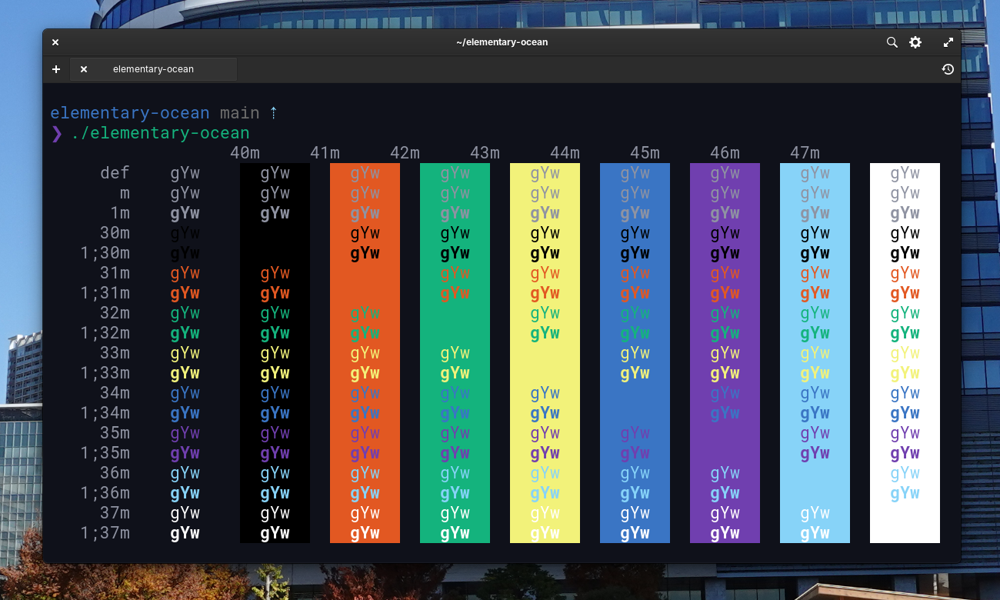

<h1 align="center">
Elementary Ocean
</h1>

<h4 align="center">
Deep oceanic blue elementary OS terminal theme
</h4>

  

## Contents

- [Install](#install)
- [Extra](#extra)
- [Related](#related)
- [Team](#team)
- [License](#license)

## Install

- Clone the repository to your local machine
- Navigate to the root directory and chmod the installation script: 
  - `$ chmod +x elementary-ocean.sh`
- Execute the installation script: 
  - `$ ./elementary-ocean.sh`
- Restart your elementary OS terminal & select the newly installed theme via the Settings

## Extra

To get the exact same look, install [oh-my-zsh](http://ohmyz.sh/) and set up [pure](https://github.com/sindresorhus/pure) as your zsh prompt.

## Related

- [hyperocean](https://github.com/klaudiosinani/hyperocean) - Hyper Terminal version
- [itermocean](https://github.com/klaudiosinani/itermocean) - iTerm version
- [oceandock](https://github.com/klaudiosinani/oceandock) - Plank dock version

## Team

- Klaudio Sinani ([@klaudiosinani](https://github.com/klaudiosinani))

## License

[MIT](license.md)
